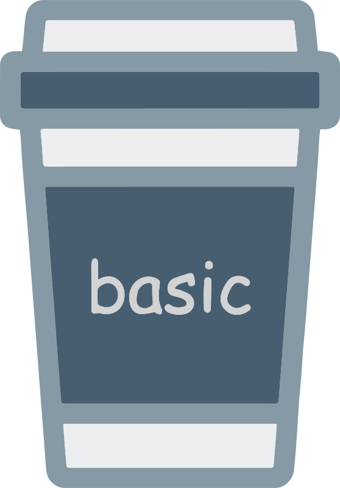

# Basic-Haptic
 


[](https://central.sonatype.com/artifact/app.lexilabs.basic/basic-haptic)
[](https://kotlinlang.org)

A Kotlin Multiplatform library to rapidly get vibration running across all your devices.


### How it works
Basic-Haptic uses each platform's native vibration libraries and patterns. For simplicity, these complex libraries have been whittled down into just two basic vibration modes: `CLICK` and `TICK`. Each platform-specific implementation has a library of additional default vibrations.

## Installation

Add your dependencies from Maven
```toml
# in your 'libs.versions.toml' file
[versions]
basic = "+" # gets the latest version

[libraries]
basic-haptic = { module = "app.lexilabs.basic:basic-haptic", version.ref = "basic"}
```

then include the library in your gradle build
```kotlin
sourceSets {
    commonMain.dependencies {
        implementation(libs.lexilabs.basic.haptic)
    }
}
```

## Usage
You'll need to pass a common value of  `context`, which is mostly so the Android side of things will work.
The Android implementation requires `Context`, while every other platform can receive `0` or `""`.
For an example of this technique, check out this [medium article](https://blog.hakz.app/contain-your-apps-memory-please-0c62819f8d7f).

```kotlin
/** inside your commonMain */

// Create a single Haptic instance to run all your vibrations
val hapticManager = Haptic(context)

// Vibrate the phone immediately using a click
hapticManager.vibrate(Haptic.DEFAULTS.CLICK)
```

## Advanced
If you're creating platform-specific implementations, you'll have access to a lot more `Haptic.DEFAULTS` values.
The best example of this is the `watchOS` implementation:
```kotlin
/** inside your watchosMain */

// Create a watchOS haptic instance
val hapticManager = Haptic("")

// Vibrate the phone using whichever unique watchOS vibration you like
hapticManager.vibrate(Haptic.DEFAULTS.UNDERWATER_DEPTH_CRITICAL_PROMPT)
```
